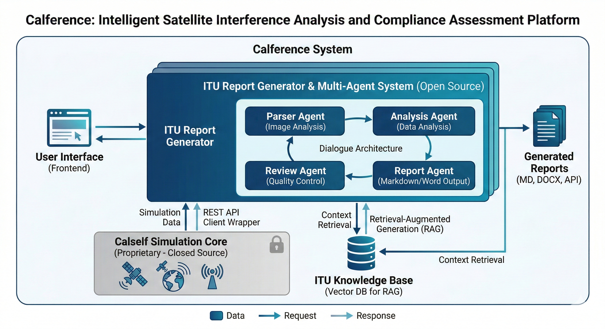

# Calference - 卫星干扰分析与报告生成系统

> **SPACENET** - 复旦大学空间互联网研究院  
> 卫星干扰智能分析与合规性评估平台

[](https://www.gnu.org/licenses/gpl-3.0)
[](https://www.python.org/downloads/)

## 📖 项目简介

Calference 是一个专业的卫星干扰分析与报告生成系统，旨在帮助研究人员和工程师：
- 🛰️ 分析卫星通信系统的干扰模式
- 📊 自动生成符合 ITU 标准的专业分析报告
- 🔍 基于 RAG（检索增强生成）技术提供智能化的合规性评估
- 🤖 使用多智能体协作生成高质量技术文档

### 主要特性

- ✅ **智能报告生成**: 基于多智能体架构，自动分析干扰图表并生成详细报告
- ✅ **ITU 标准合规**: 集成 ITU 标准文档，提供合规性评估和建议
- ✅ **多格式输出**: 支持 Markdown 和 Word 双格式输出
- ✅ **RAG 增强**: 使用检索增强生成技术，引用相关标准文档
- ✅ **灵活架构**: 支持多种 LLM 后端（GLM、Claude 等）
- ✅ **REST API**: 提供标准化的 HTTP API 接口

## 🏗️ 系统架构



### 开源说明

**本项目为部分开源项目：**

- ✅ **开源部分**:
  - ITU 干扰报告生成器（`itu_report_generator/`）
  - API 客户端封装（`calself_client/`）
  - 使用示例和文档（`examples/`, `docs/`）
  - 前端界面（`frontend/`）

- 🔒 **闭源部分**:
  - Calself 核心仿真引擎（卫星干扰计算算法）
  - 仿真服务端实现
  
**注**: Calself 仿真服务通过 REST API 提供，用户可以通过客户端调用，无需接触底层实现。

## 📁 项目结构

```
Calference v1.0/
├── examples/                          # 📚 使用示例
│   ├── example_calself_usage.py       # Calself 服务使用示例
│   ├── example_itu_report.py          # ITU 报告生成示例
│   └── README.md                      # 示例文档
│
├── calself_client/                    # 🔌 API 客户端（开源）
│   ├── client.py                      # REST API 客户端实现
│   └── __init__.py
│
├── calself_service/                   # 🎯 服务中间层（开源）
│   └── service.py                     # 服务接口封装
│
├── itu_report_generator/              # 📊 报告生成器（开源）
│   ├── itu_interference_analyzer.py   # 主程序（4智能体对话式）
│   ├── report_service.py              # 服务接口
│   ├── config.py                      # 配置文件
│   ├── src/                           # 源代码
│   │   ├── itu_file_rag.py            # RAG 检索模块（文件系统）
│   │   ├── prepare_data.py            # 数据准备脚本
│   │   └── download_embedding_model.py # 模型下载脚本
│   ├── frontend/                      # Web 前端
│   │   ├── api.py                     # FastAPI 服务
│   │   └── static/                    # 静态文件
│   └── data/                          # 数据目录（模块级，可选）
│
├── docs/                              # 📖 文档
│   └── USER_MANUAL.md                 # 详细使用手册
│
├── requirements.txt                   # Python 依赖
├── LICENSE                            # GPL-3.0 许可证
└── README.md                          # 本文件
```

## 🚀 快速开始

### 系统要求

- Python 3.10 或更高版本
- 4GB+ RAM
- （可选）pandoc（用于生成 Word 文档）
- （可选）CUDA（用于 GPU 加速）

### 一键初始化（推荐）

```bash
# 1. 克隆项目
git clone <repository_url>
cd calference_ai

# 2. 创建虚拟环境（推荐）
conda create -n itu python=3.10
conda activate itu

# 3. 一键初始化（自动安装依赖、下载模型、准备数据）
python init.py --auto

# 4. 配置 LLM API 密钥
export LLM_API_KEY="your_api_key_here"

# 5. 运行示例
python run.py itu-report
```

### 手动安装

```bash
# 1. 克隆项目
git clone <repository_url>
cd calference_ai

# 2. 创建虚拟环境（推荐）
conda create -n itu python=3.10
conda activate itu

# 3. 安装依赖
pip install -r requirements.txt

# 4. （可选）安装 pandoc 用于生成 Word 文档
# Ubuntu/Debian:
sudo apt install pandoc

# macOS:
brew install pandoc

# Windows:
# 下载安装器: https://pandoc.org/installing.html

# 5. 准备数据
python run.py download-model
python run.py prepare-rag
```

### 配置 LLM API

编辑 `itu_report_generator/config.py` 或设置环境变量：

```bash
# GLM 配置（推荐）
export LLM_MODEL_NAME="glm-4v-flash"
export LLM_BASE_URL="https://open.bigmodel.cn/api/paas/v4"
export LLM_API_KEY="your_api_key_here"

# 或 Claude 配置
export LLM_MODEL_NAME="claude-3-7-sonnet-20250219"
export LLM_BASE_URL="http://your-proxy:8000"
export LLM_API_KEY="your_api_key_here"
```

### 运行示例

#### 方式一：使用统一运行脚本（推荐）

项目提供了统一的 `run.py` 脚本，可以快速运行所有功能：

```bash
# 查看所有可用命令
python run.py --help

# 生成 ITU 干扰报告
python run.py itu-report

# 指定自定义图片
python run.py itu-report --image path/to/your/image.png

# 运行 Calself 卫星仿真（0.1小时）
python run.py calself-sim --duration 0.1

# 准备 RAG 数据
python run.py prepare-rag

# 下载 embedding 模型
python run.py download-model

# 启动 Web API 服务（默认端口 8001）
python run.py web-api

# 启动 Calself 仿真服务（默认端口 8000，仅限开发者）
python run.py calself-service

# 显示项目状态
python run.py status

# 运行示例
python run.py example itu_report
python run.py example calself_usage
```

#### 方式二：使用 Makefile（快速命令）

项目提供了 Makefile，可以用简洁的命令运行各项功能：

```bash
# 查看所有可用命令
make help

# 完整项目设置（安装依赖+准备数据）
make setup

# 生成 ITU 干扰报告
make itu-report

# 运行 Calself 卫星仿真
make calself-sim

# 准备 RAG 数据
make prepare-rag

# 下载 embedding 模型
make download-model

# 启动 Web API 服务
make web-api

# 启动 Calself 仿真服务
make calself-service

# 运行示例
make example-itu
make example-calself

# 显示项目状态
make status

# 清理临时文件
make clean
```

#### 方式三：使用快速启动脚本

项目提供了 `quickstart.sh` 脚本，支持 Linux/macOS：

```bash
# 添加执行权限
chmod +x quickstart.sh

# 查看帮助
./quickstart.sh help

# 生成 ITU 干扰报告
./quickstart.sh itu-report

# 运行 Calself 仿真
./quickstart.sh calself-sim --duration 0.5

# 启动 Web 服务（默认端口 8001）
./quickstart.sh web-api

# 显示项目状态
./quickstart.sh status
```

#### 方式四：直接运行示例脚本

```bash
# 使用默认示例图片
python examples/example_itu_report.py

# 或指定自定义图片
python examples/example_itu_report.py path/to/your/image.png

# Calself 仿真服务（需要先启动服务端）
export CALSELF_BASE_URL="http://localhost:8000"
python examples/example_calself_usage.py
```

## 🛠️ 项目工具

项目提供了多种便捷的运行工具，满足不同使用场景：

### 1. 统一运行脚本 (`run.py`)

功能完整的 Python 脚本，支持所有项目功能：

```bash
python run.py --help                    # 查看所有命令
python run.py itu-report                # 生成报告
python run.py calself-sim               # 运行仿真
python run.py web-api                   # 启动 Web 服务
python run.py status                    # 显示项目状态
```

### 2. Makefile 快速命令

简洁的 Makefile 命令，适合频繁使用：

```bash
make help                               # 查看所有命令
make setup                              # 完整项目设置
make itu-report                         # 生成报告
make web-api                            # 启动 Web 服务
make clean                              # 清理临时文件
```

### 3. 快速启动脚本 (`quickstart.sh`)

Shell 脚本，支持 Linux/macOS：

```bash
chmod +x quickstart.sh
./quickstart.sh help                    # 查看帮助
./quickstart.sh itu-report              # 生成报告
./quickstart.sh web-api --port 8000     # 启动服务
```

### 4. 项目初始化脚本 (`init.py`)

一键初始化项目，自动安装依赖和准备数据：

```bash
python init.py                          # 交互式初始化
python init.py --auto                   # 自动初始化
python init.py --check                  # 仅检查环境
```

### 5. 综合使用示例 (`examples_comprehensive.py`)

交互式示例脚本，演示所有主要功能：

```bash
python examples_comprehensive.py        # 启动交互式菜单
```

## 📖 文档

- **快速入门**: [QUICKSTART.md](QUICKSTART.md) - 5分钟快速开始指南
- **命令参考**: [COMMANDS.md](COMMANDS.md) - 完整命令参考卡片
- **使用手册**: [docs/USER_MANUAL.md](docs/USER_MANUAL.md) - 详细使用手册

## 📊 主要功能

### 1. ITU 干扰报告自动生成

使用多智能体协作生成专业的干扰分析报告：

```python
from pathlib import Path
from itu_report_generator.report_service import generate_report

# 生成报告
result = await generate_report(
    image_path=Path("data/input/oneweb_total_earth_cinr.png"),
    use_rag=True  # 启用 RAG 检索
)

print(f"报告已生成: {result['markdown_path']}")
```

**报告生成流程：**
1. Parser Agent - 解析图片信息
2. Analysis Agent - 分析干扰数据
3. Review Agent - 审查分析结果
4. Report Agent - 生成最终报告（Markdown + Word）

### 2. Calself 仿真服务调用

通过 REST API 调用卫星干扰仿真服务：

```python
from datetime import datetime
from calself_service import get_service

# 初始化服务
service = get_service("http://localhost:8000")

# 运行仿真
result = service.run_simulation(
    start_time=datetime(2024, 12, 16, 0, 0, 0),
    duration_hours=0.1,
    step=2
)

# 获取结果
files = service.get_inference_files(company_id=1)
data = service.load_inference_file(1, files["1"][0])
```

#### ⚠️ 关于 TLE 错误信息

运行仿真时，您可能会看到大量的 TLE（两行轨道根数）错误信息，例如：

```
Error 6 for tle 1 at time 2026-02-10 15:57:00.360973
Error 1 for tle 20 at time 2026-02-10 15:57:00.360973
...
```

**这是正常现象，不需要担心。** 这些错误来自 SGP4 轨道预测库，表示：

- **Error 1**: 卫星已衰减（Decayed satellite）- 卫星轨道已衰减或已坠落
- **Error 6**: 卫星衰减或轨道计算异常 - 卫星轨道参数超出有效范围

**原因：**
1. TLE 数据可能不是最新的
2. 某些卫星的轨道已经衰减，不再有效
3. 轨道参数超出了 SGP4 模型的有效范围

**这不会影响仿真的进行** - 程序会继续运行，仿真会正常完成。如果想减少这些信息，可以更新 TLE 数据到最新版本。

### 3. RAG 检索增强

集成 ITU 标准文档，自动检索相关标准：

```python
from itu_report_generator.src.itu_file_rag import get_itu_file_rag_instance

rag = get_itu_file_rag_instance()
results = rag.search("CINR threshold limit", top_k=3)

for result in results:
    print(f"来源: {result['source']}")
    print(f"相关度: {result['score']:.3f}")
    print(f"内容: {result['text'][:200]}...")
```

## 🛠️ 开发指南

### 多智能体架构

报告生成器采用 4智能体对话式架构：

```python
Parser Agent (parser_agent)
    ↓ 解析图片信息，提取结构化数据
    
Analysis Agent (analysis_agent)
    ↓ 分析干扰数据，生成分析结果
    
Review Agent (review_agent)
    ↓ 审查分析结果，确保准确性
    
Report Agent (report_agent)
    ↓ 生成最终报告（Markdown + Word）
```

**优势：**
- ✅ 每个智能体专注于特定任务
- ✅ 通过对话协作提升质量
- ✅ 自动追踪数据流和审计日志
- ✅ 输出高质量专业报告

### 自定义 LLM 后端

修改 `itu_report_generator/config.py`：

```python
# LLM 配置
LLM_MODEL_NAME = "your-model-name"
LLM_BASE_URL = "https://your-api-endpoint"
LLM_API_KEY = "your-api-key"

# RAG 配置
USE_RAG = True
RAG_TOP_K = 3

# 输出配置
OUTPUT_REPORT_DIR = "data/output_reports"
```

## 📖 文档

### 快速参考

- **快速参考卡片**: [QUICK_REFERENCE.md](QUICK_REFERENCE.md) - 最常用命令速查表
- **快速入门**: [QUICKSTART.md](QUICKSTART.md) - 5分钟快速开始指南
- **命令参考**: [COMMANDS.md](COMMANDS.md) - 完整命令参考卡片
- **脚本总结**: [SCRIPTS_SUMMARY.md](SCRIPTS_SUMMARY.md) - 所有运行脚本的详细说明
- **初始化检查清单**: [SETUP_CHECKLIST.md](SETUP_CHECKLIST.md) - 项目设置验证清单

### 详细文档

- **使用示例**: [examples/README.md](examples/README.md)
- **详细使用手册**: [docs/USER_MANUAL.md](docs/USER_MANUAL.md)
- **API 文档**: [docs/api.md](docs/api.md)（即将推出）

### 环境配置

- **环境变量示例**: [.env.example](.env.example) - 复制并编辑此文件配置环境变量

## 🤝 贡献指南

我们欢迎对开源部分的贡献！

### 可以贡献的内容：
- ✅ ITU 报告生成器改进
- ✅ 文档完善
- ✅ Bug 修复
- ✅ 新功能建议
- ✅ 示例代码

### 贡献流程：
1. Fork 本项目
2. 创建特性分支 (`git checkout -b feature/AmazingFeature`)
3. 提交更改 (`git commit -m 'Add some AmazingFeature'`)
4. 推送到分支 (`git push origin feature/AmazingFeature`)
5. 开启 Pull Request

**注意**: 请不要尝试修改或逆向 Calself 闭源部分。

## 📄 许可证

本项目的开源部分采用 **GNU General Public License v3.0** 许可证。

- **开源部分** (GPL-3.0):
  - ITU 报告生成器
  - API 客户端
  - 文档和示例

- **闭源部分** (专有许可):
  - Calself 仿真引擎
  
详见 [LICENSE](LICENSE) 文件。

## 🙏 致谢

- SPACENET - 复旦大学空间互联网研究院
- AutoGen 团队（多智能体框架）
- ITU（国际电信联盟，标准文档）
- 智谱 AI / Anthropic（LLM 支持）

## 📞 联系我们

- **研究机构**: SPACENET - 复旦大学空间互联网研究院
- **问题反馈**: [GitHub Issues](https://github.com/your-org/Calference/issues)
- **邮件**: support@example.com

---

## 🔖 版本历史

### v1.1.0 (2026-02-06)
- ✨ 新增 4智能体分段式报告生成
- 🚀 优化项目结构，分离开源和闭源部分
- 📚 完善文档和使用示例
- 🐛 修复 token 超限问题
- 🎨 改进报告格式和质量

### v1.0.0 (2025-11-03)
- 🎉 初始版本发布
- ✨ ITU 报告生成器
- ✨ Calself API 客户端
- ✨ RAG 检索功能

---

**Made with ❤️ by SPACENET**
